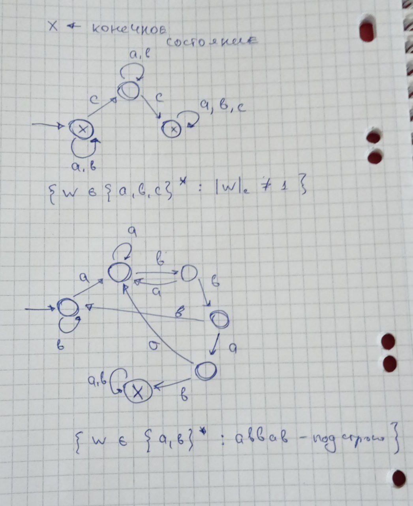

# HW02

## Конечный автомат

## Дедлайн 23:59 20.02

1. (2 балла) Использовать новый тип для парсера в вашем парсере арифметических выражений. Реализовать инстансы Monad и Alternative, а также других классов, если это необходимо, чтобы можно было писать парсеры с использованием do-нотации.
2. (2 балла) Можно ли было обойтись без трансформации списка `go :: (elem, [(sep, elem)]) -> ([(elem, sep)], elem)` в реализации функции-обработчика `rightAssoc`, сразу реализовав парсер списка `listR :: Parser elem -> Parser sep -> Parser ([(elem, sep)], elem)`? Если да, то привести реализацию, если нет, то обосновать.
3. (2 балла) Привести детерминированные конечные автоматы для следующих языков:
   * `{ w \in {a,b,c}* | |w|_c /= 1 }`: количество букв `c` в слове -- не 1
   * `{ w \in {a, b}* | abbab -- подстрока w }`

## Процедура сдачи

1. Сделать форк этого репозитория.
2. Выполнить домашку в своем форке в соответствующей ветке.
3. Отправить PR со сделанной домашкой в этот репозиторий.
4. Код должен собираться, тесты должны проходить.

## Сборка и запуск

1. `stack build` для сборки.
2. `stack test` для запуска тестов.
3. `stack exec exe -- <args>` для запуска консольного приложения.
   1. `stack exec exe -- "+*123" -p -d` для запуска парсера для арифметики в префиксной записи на строке с отображением результата в консоли.
   2. `stack exec exe -- -i test.txt -o test.out` для запуска парсера для арифметики в инфиксной записи на содержимом файла `test.txt`; результат будет записан в файл `test.out`.
4. `stack run exe -- <args>` для запуска консольного приложения с предварительной сборкой проекта.

[Запись лекции](https://drive.google.com/file/d/1Qv3mpYgkVidS0DcGt4b352ANcvE8Mr9w/view?usp=sharing)
